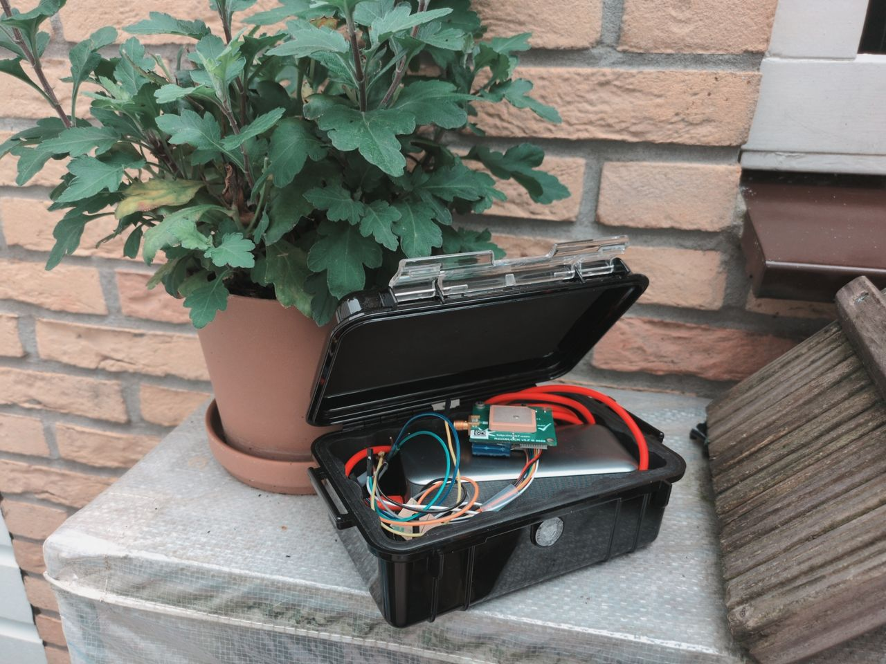
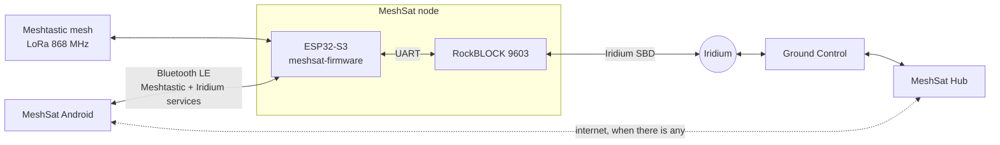
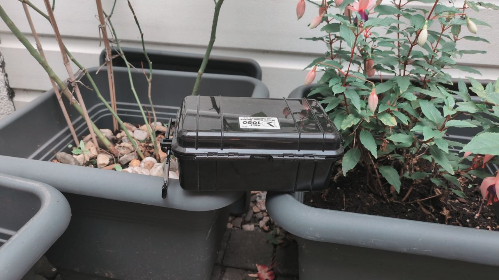

<picture>
  <source media="(prefers-color-scheme: dark)" srcset="docs/images/mark-dark.png">
  
</picture>

### A pocket-sized MeshSat node: LoRa mesh and Iridium satellite in one small case.

[Docs](https://docs.meshsat.net/node/) ·
[Node firmware](https://github.com/meshsat/meshsat-firmware) ·
[Hardware](#hardware) ·
[What is proven](#what-is-proven-and-what-is-not) ·
[Bench manual](docs/BENCH.md) ·
[meshsat.net](https://meshsat.net)

The v0 node on its bench: a garden ledge with a limited view of the sky.

This is the small MeshSat node. It puts a Meshtastic LoRa radio and a RockBLOCK 9603 Iridium modem in one pocket-size case. A phone connects to it over one Bluetooth link and gets both: the mesh through the normal Meshtastic service, and the satellite modem through a second MeshSat service next to it.

The [MeshSat Android](https://github.com/meshsat/meshsat-android) app does the routing, the queueing and the credit accounting, so the node itself stays simple. While the app is connected, the modem is the app's. Routing on the node itself, for when no phone is around, comes next.

> **Status: pre-release.** This is a prototype under active development, not a finished product. It has never been deployed to a real user and has never been used in an actual emergency. See [What is proven, and what is not](#what-is-proven-and-what-is-not) before you rely on it for anything.

## How it fits together

The node runs [meshsat-firmware](https://github.com/meshsat/meshsat-firmware), a fork of the Meshtastic firmware with one addition: a binary-safe serial pipe from Bluetooth to the RockBLOCK. The app speaks the 9603's AT commands through that pipe, exactly as it would over a cable. The pipe's contract (UUIDs, owner status, pairing) is in [docs/IRIDIUM-BLE.md](docs/IRIDIUM-BLE.md).

## Hardware

Two versions. v0 proved the idea on the bench; v1 is the one meant to become a product.

| | v0 (bench) | v1 (prototype) |
|---|---|---|
| Board | Seeed Studio XIAO ESP32-S3 + Wio-SX1262 | LILYGO T-Beam Supreme (ESP32-S3, SX1262, u-blox M10S GPS) |
| Satellite | RockBLOCK 9603 | RockBLOCK 9603 |
| Power | USB power bank | one 18650 cell in the T-Beam, charged over USB-C; the modem runs from the T-Beam's power chip |
| Case | Peli 1050 | Peli 1020, IP68 USB-C and a panel power button |
| Firmware env | `meshsat-xiao-s3-rockblock` | `meshsat-tbeam-s3-rockblock` |
| State | Tested on the bench, September 2026 | Parts arriving, not built yet |

The RockBLOCK needs an active Ground Control line rental and message credits. Every satellite session is billed, even one that only checks for mail.

**RockBLOCK wiring, four wires either way.** Pin 7 (OnOff) and pin 9 (Li-Ion) stay unconnected.

| RockBLOCK pin | v0: XIAO ESP32-S3 | v1: T-Beam Supreme header PM1 |
|:---:|---|---|
| 1 RXD (modem output) | D7, GPIO44 | pin 12, GPIO44 |
| 6 TXD (modem input) | D6, GPIO43 | pin 13, GPIO43 |
| 8 power in | a 5 V source rated ≥ 500 mA | pin 9, DCDC5 (switched by the firmware) |
| 10 GND | GND, shared with the 5 V source | pin 8, GND |

On v0, use the XIAO's own D6/D7 pads. The Wio-SX1262's D5/D6/D7 pads are not connected on the ESP32-S3 kit. A step-by-step build guide for both versions is on [docs.meshsat.net](https://docs.meshsat.net/node/build). The full v0 wiring, power notes and troubleshooting are in the [bench manual](docs/BENCH.md), and every hardware fact with its source is in [docs/REFERENCES.md](docs/REFERENCES.md).

## What is proven, and what is not

| | State |
|---|---|
| Meshtastic to the MeshSat Android app over Bluetooth (v0) | Verified on the bench, 19 Sep 2026: bonded with a fixed PIN, full config sync |
| Iridium modem over the same Bluetooth link (v0) | Verified on the bench, 19 Sep 2026: AT commands, and a binary loopback of up to 270 bytes |
| A satellite message out, Hub to phone to node to Iridium | One message delivered, 19 Sep 2026 |
| A satellite message in, fetched by the app after a ring alert | One message received, 19 Sep 2026 |
| The app reconnecting after its own restart and taking the modem back | Verified 19 Sep 2026. Recovery from a drop mid-session has **not been exercised yet** |
| v1 on the T-Beam Supreme | Firmware builds. **Not run on hardware yet** |
| Routing on the node with no phone connected | **Not built yet** |
| Battery life | **Not measured** |
| Range, weather, long-term reliability | **Not tested** |
| Deployment to a real end user | **Never** |
| Use in an actual emergency | **Never** |

The satellite results come from a garden with a limited view of the sky. There the signal read zero bars minutes before and after a session that got through, so the app never waits for bars before it sends.

## What is in this repository

- **Bench firmware** for v0 in `src/`, with host tests in `tests/` and a Bluetooth console client in `tools/`. It tests the modem link and passes AT commands through over USB or Bluetooth. How to build and use it: [docs/BENCH.md](docs/BENCH.md).
- **The Iridium Bluetooth service contract** in [docs/IRIDIUM-BLE.md](docs/IRIDIUM-BLE.md): what a client writes, reads and subscribes to.
- **Hardware references** in [docs/REFERENCES.md](docs/REFERENCES.md): pin maps checked against the schematics, the 9603 facts, and the places where official documents disagree.

The node's product firmware lives in [meshsat-firmware](https://github.com/meshsat/meshsat-firmware).

## Related projects

- **[MeshSat](https://github.com/meshsat/meshsat)**, the Bridge: a Raspberry Pi gateway that bonds Meshtastic, Iridium, cellular SMS, APRS, ZigBee and TCP
- **[MeshSat Android](https://github.com/meshsat/meshsat-android)**, the phone gateway this node pairs with
- **[meshsat-firmware](https://github.com/meshsat/meshsat-firmware)**, the node's firmware
- **[MeshSat Field Kit](https://github.com/meshsat/meshsat-fieldkit)**, the hardware for the larger field kits
- **[MeshSat Hub](https://hub.meshsat.net)**, multi-tenant fleet management

## License

Copyright 2026 Elli and Kyriakos. [GNU General Public License v3.0](LICENSE).
